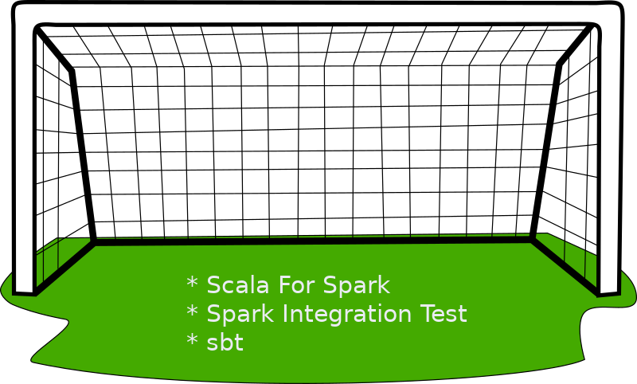
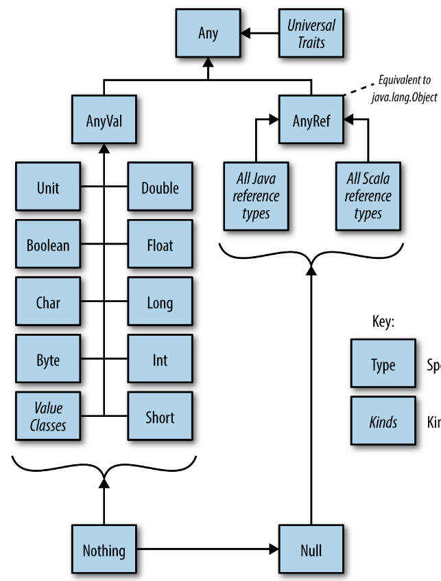
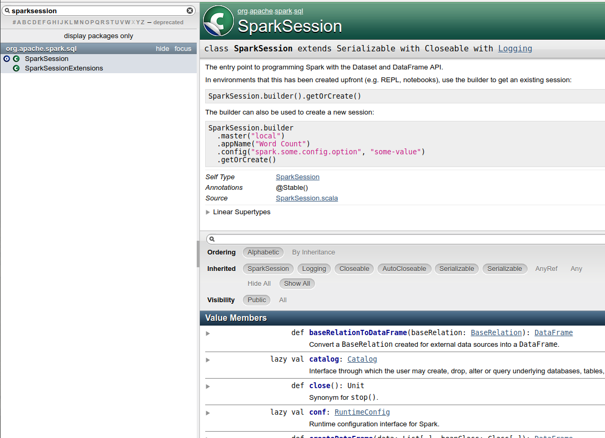
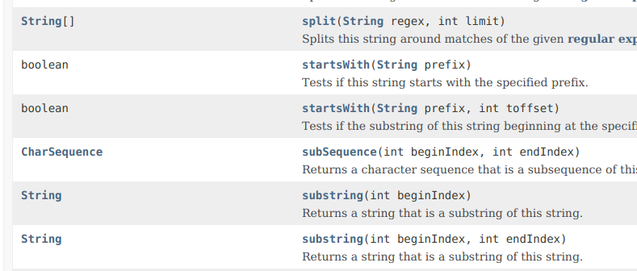
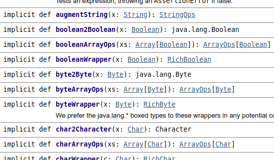
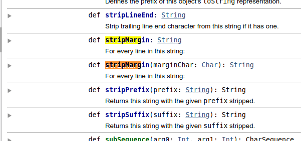
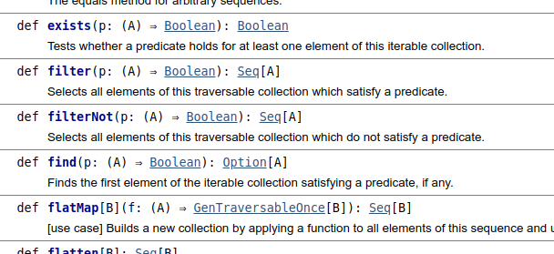

---
header-includes:
 - \usepackage{fvextra}
 - \DefineVerbatimEnvironment{Highlighting}{Verbatim}{breaklines,commandchars=\\\{\}}
 - \usepackage{fontspec}
title: Scala for Apache Spark
author: Markus Dale, medale@asymmetrik.com
date: Jan 2019
---

# Intro, Slides And Code
* Slides: https://github.com/medale/scala-spark/blob/master/presentation/ScalaSpark.pdf
* Scala Spark Code Examples: https://github.com/medale/scala-spark

# Goals



# Why Scala for Spark?
* full interoperability with Java
     * strong type system
     * elegant multi-paradigm (functional & OO)
     * less boilerplate/less code
* JVM

# Java to Scala - Java Main

\small
```java
package com.uebercomputing.scalaspark.common;
public class JavaMain { 
  private int answer = 0;
  public JavaMain(int answer) {
    this.answer = answer;
  }
  public int getAnswer() {
     return answer;
  }
  public static void main(String[] args) {
    System.out.println("Starting a Java program...");
    JavaMain jaMain = new JavaMain(42);
    int answer = jaMain.getAnswer();
    System.out.println("The answer was " + answer);
  }
}
```

# Scala Main One

\small
```scala
package com.uebercomputing.scalaspark.common

class ScalaMainOne(val answer: Int)

object ScalaMainOne {

  def main(args: Array[String]): Unit = {
    println("Starting a Scala program...")
    val scMain = new ScalaMainOne(42)
    println(scMain)
    val answer = scMain.answer
    println(s"The answer was ${answer}")
  }
}
```

# Scala Main One - Output

\small
```bash
Starting a Scala program...
com.uebercomputing.scalaspark.common.ScalaMainOne@256216b3
The answer was 42
```

# Scala Main Two - case class

\small
```scala
package com.uebercomputing.scalaspark.common

case class ScalaMainTwo(answer: Int)

object ScalaMainTwo {

  def main(args: Array[String]): Unit = {
    println("Starting a Scala program...")
    //ScalaMainTwo.apply(42)
    val scMain = ScalaMainTwo(42)
    println(scMain)
    val answer = scMain.answer
    println(s"The answer was ${answer}")
  }

}
```

# Scala Main Two - Output

\small
```bash
Starting a Scala program...
ScalaMainTwo(42)
The answer was 42
```

# Scala Main Two - javap ScalaMainTwo.class

```java
public class ScalaMainTwo implements Product,Serializable
  public static Option<Object> unapply(ScalaMainTwo);
  public static ScalaMainTwo apply(int);
...
  public ScalaMainTwo copy(int);
...
  public int productArity();
  public Object productElement(int);
  public Iterator<Object> productIterator();
...
  public int hashCode();
  public String toString();
  public boolean equals(Object);
...
```
# HelloSparkWorld - expression-oriented

```scala
object HelloSparkWorld {
...
  def main(args: Array[String]): Unit = {

    val lines = if (!args.isEmpty) {
      val inputFile = args(0)
      readLinesFromFile(inputFile)
    } else {
      readLinesFromString(GhandiQuote)
    }
    ...
}
```

# Scala Type Hierarchy




# HelloSparkWorld - SparkSession

```scala
import org.apache.spark.sql.SparkSession
...
val spark = SparkSession.builder.
   appName("HelloSparkWorld").
   master("local[2]").
   getOrCreate()

val lines = ... 

wordCountRdd(spark, lines)

spark.close()
```

# SparkSession Scala API



# HelloSparkWorld - String, StringOps, implicits

```scala
val GhandiQuote =
    """Live as if you were to die tomorrow
      |Learn as if you were to live forever""".stripMargin
      
def readLinesFromString(input: String): Seq[String] = {
  val lines = input.split("\n")
  lines
}
...
readLinesFromString(GhandiQuote)
```

# Java API - String




# Scala Predef API - implicit conversions




# Scala StringOps API - stripMargin




# HelloSparkWorld - accessing Java API/libraries

```scala
import java.nio.file.Files
import java.nio.file.Paths
import java.util.{List => JavaList}

import scala.collection.JavaConverters._

def readLinesFromFile(inputFile: String): Seq[String] = {
  val inputPath = Paths.get(inputFile)
  val linesJava: JavaList[String] = 
     Files.readAllLines(inputPath)
  val lines = linesJava.asScala //mutable.Buffer
  lines
}
```

# HelloSparkWorld - map, flatMap, filter

```scala
val lowerCaseLines = lines.map { line => line.toLowerCase }
val words = lowerCaseLines.flatMap { line => line.split("""\s+""")}
val noStopWords = words.filter(word => !StopWords.contains(word))
val wordsMap: Map[String,Seq[String]] = noStopWords.groupBy( w => identity(w))
val wordCountsMap = wordsMap.map { case (key, values) => (key, values.size)}
println(s"The word counts were: ${wordCountsMap.mkString("\n","\n","\n")}")
```

# Scala Seq trait API



# HelloSparkWorld - RDDs


