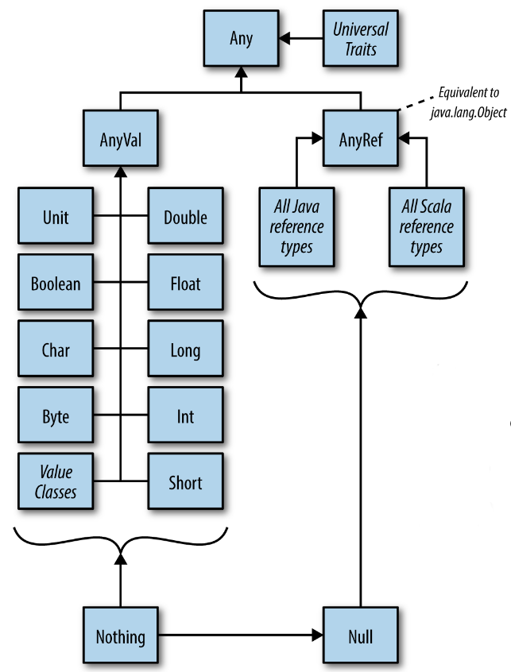
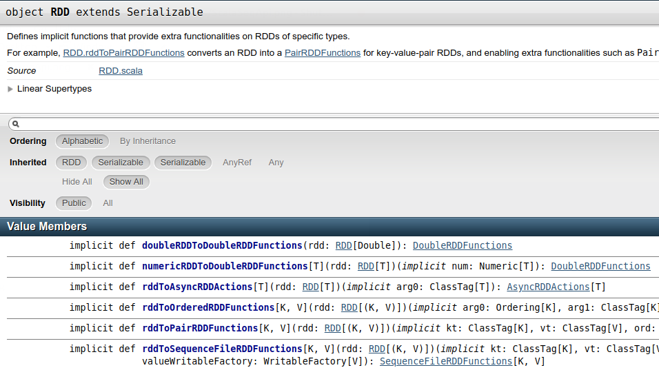
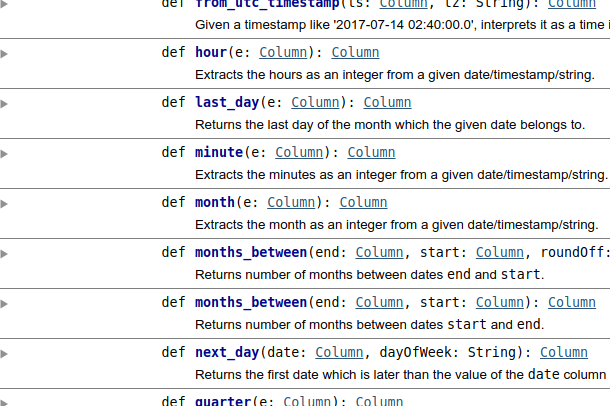

---
header-includes:
 - \usepackage{fvextra}
 - \DefineVerbatimEnvironment{Highlighting}{Verbatim}{breaklines,commandchars=\\\{\}}
 - \usepackage{fontspec}
 - \usepackage{setspace}
title: Scala for Apache Spark
author: Markus Dale, medale@asymmetrik.com
date: Jan 2019
---

# Intro, Slides And Code
* Slides: https://github.com/medale/scala-spark/blob/master/presentation/ScalaSpark.pdf
* Scala Spark Code Examples: https://github.com/medale/scala-spark

# Goals


# Why Scala for Spark?
* full interoperability with Java
     * strong type system
     * elegant multi-paradigm (functional & OO)
     * less boilerplate/less code
* JVM

# Java to Scala - Java Main

\small
```java
package com.uebercomputing.scalaspark.common;
public class JavaMain { 
  private int answer = 0;
  public JavaMain(int answer) {
    this.answer = answer;
  }
  public int getAnswer() {
     return answer;
  }
  public static void main(String[] args) {
    System.out.println("Starting a Java program...");
    JavaMain jaMain = new JavaMain(42);
    int answer = jaMain.getAnswer();
    System.out.println("The answer was " + answer);
  }
}
```

# Scala Main One

\small
```scala
package com.uebercomputing.scalaspark.common

class ScalaMainOne(val answer: Int)

object ScalaMainOne {

  def main(args: Array[String]): Unit = {
    println("Starting a Scala program...")
    val scMain = new ScalaMainOne(42)
    val answer = scMain.answer
    println(s"The answer was ${answer}")
  }
}
```
\normalsize

# HelloSparkWorld - expression-oriented

```scala
object HelloSparkWorld {
...
  def main(args: Array[String]): Unit = {

    val lines = if (!args.isEmpty) {
      val inputFile = args(0)
      readLinesFromFile(inputFile)
    } else {
      readLinesFromString(GhandiQuote)
    }
    ...
}
```

# Scala Type Hierarchy




# HelloSparkWorld - SparkSession

\small
```scala
import org.apache.spark.sql.SparkSession
...
def main(args: Array[String]): Unit = {
   val lines = ...

   wordCountLocal(lines)

   val spark = SparkSession.builder.
      appName("HelloSparkWorld").
      master("local[2]").
      getOrCreate()

   wordCountRdd(spark, lines)

   spark.close()
}
```
\normalsize

# SparkSession Scala API


# HelloSparkWorld - String, StringOps, implicits

```scala
val GhandiQuote =
    """Live as if you were to die tomorrow
      |Learn as if you were to live forever""".stripMargin
      
def readLinesFromString(input: String): Seq[String] = {
  val lines = input.split("\n")
  lines
}
...
readLinesFromString(GhandiQuote)
```

# Java API - String


# Scala Predef API - implicit conversions


# Scala StringOps API - stripMargin


# HelloSparkWorld - accessing Java API/libraries

\small
```scala
import java.nio.file.Files
import java.nio.file.Paths
import java.util.{List => JavaList}

import scala.collection.JavaConverters._

def readLinesFromFile(inputFile: String): Seq[String] = {
  val inputPath = Paths.get(inputFile)
  val linesJava: JavaList[String] = 
     Files.readAllLines(inputPath)
  val lines = linesJava.asScala //mutable.Buffer
  lines
}
```
\normalsize

# wordCountLocal: map higher-order function w/named function

```scala
def wordCountLocal(lines: Seq[String]): Unit = {

  def toLower(s: String): String = {
    s.toLowerCase
  }

  val lowerLines = lines.map(toLower)
  ...
```

# wordCountLocal: map higher-order function w/ function literal

```scala
//function literal - anonymous function explicit type: 
lines.map((l: String) => l.toLowerCase)

//function literal - anonymous with inferred type:
lines.map(l => l.toLowerCase)

//function literal with placeholder syntax
lines.map(_.toLowerCase)
```

# map function


# flatMap 


# wordCountLocal: flatMap, filter
```scala

val words = lowerLines.flatMap { line => 
   line.split("""\s+""")
}

val noStopWords = words.filter(!StopWords.contains(_))
```

# Scala Seq trait API


# wordCountLocal: foldLeft

```scala
val emptyMapWithZeroDefault =
  Map[String, Int]().withDefaultValue(0)

//foldLeft(z: B)((B,A) => B): B
val wordCountsMap: Map[String, Int] =
  noStopWords.foldLeft(emptyMapWithZeroDefault)(
    (wcMap, word) => {
      val newCount = wcMap(word) + 1
      wcMap + (word -> newCount)
    })
```

# wordCountLocal: mkString

\small
```scala
val countsString = wordCountsMap.mkString("\n", "\n", "\n")
println(s"The word counts were: ${countsString}")
```
\normalsize

# HelloSparkWorld - RDD map, flatMap, filter

\small
```scala
//val mixedLinesRdd = spark.read.textFile(inputPath).rdd
val sc = spark.sparkContext

val mixedLinesRdd: RDD[String] = 
   sc.parallelize(seq = lines, numSlices = 2)
   
val lowerLinesRdd = mixedLinesRdd.map(_.toLowerCase)

val wordsRdd = lowerLinesRdd.flatMap(_.split("""\s+"""))

val noStopWordsRdd = wordsRdd.filter(!StopWords.contains(_))
```
\normalsize

# HelloSparkWorld - RDD of tuples - PairRDDFunctions

```scala
 //groupBy - expensive to shuffle words across partition!
val wordCountTuplesRdd = noStopWordsRdd.map { (_, 1) }

val wordCountsRdd = wordCountTuplesRdd.reduceByKey(_ + _)

//and Action!
val localWordCounts = wordCountsRdd.collect()
```

# RDD object API



# HelloSparkDatasetWorld - Scala case class

```scala
case class Person(firstName: String,
                  lastName: String,
                  age: Int)
```

# HelloSparkDatasetWorld - javap Person.class

\small
```java
public class Person implements Product,Serializable {
  public static Option<Tuple3<String,String,Object>> unapply(Person);
  public static Person apply(String, String, int);
...
  public String firstName();
  public String lastName();
  public int age();
...  
  public Person copy(String, String, int);
...
  public String productPrefix();
  public int productArity();
  public Object productElement(int);
  public Iterator<Object> productIterator();
...
  public int hashCode();
  public String toString();
  public boolean equals(Object);
  public Person(String, String, int);
}

```
\normalsize

# HelloSparkDatasetWorld - Encoder

```scala
//Person.apply("John...
val persons = List(Person("John","Doe",42),
      Person("Jane","Doe",43))

//createDataset[T : Encoder](data: Seq[T]): Dataset[T]
import spark.implicits._
val people: Dataset[Person] = spark.createDataset(persons)

val olderCutoff = 42
//ageCol.>(olderCutoff)
val olderFirstNames: Dataset[Row] = people.
      where($"age" > olderCutoff).
      select("firstName")
```

# Column-based: org.apache.spark.sql.functions._

